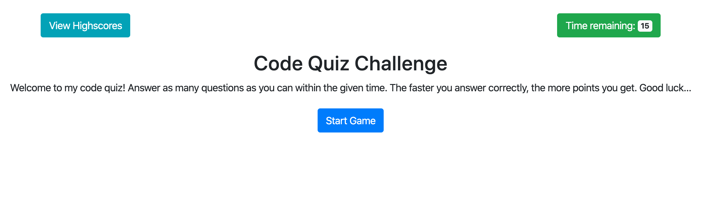

# Code Quiz Assignment
This project utilizes Javascript to interact with the HTML DOM to dynamically update onscreen content without refreshing the page. High scores are saved to local storage in the browser.

## Screenshot

## Deployed URL
https://jaredbucko.github.io/code-quiz/index.html
